# klotski (华容道)

A fast JavaScript engine for solving klotski games.

[](https://badge.fury.io/js/klotski)
[](https://travis-ci.org/jeantimex/klotski)
[](https://coveralls.io/github/jeantimex/klotski?branch=master)
[](https://david-dm.org/jeantimex/klotski)
[](https://david-dm.org/jeantimex/klotski?type=dev)
[](https://www.paypal.com/cgi-bin/webscr?cmd=_s-xclick&hosted_button_id=BFXQGY77CV3T2)

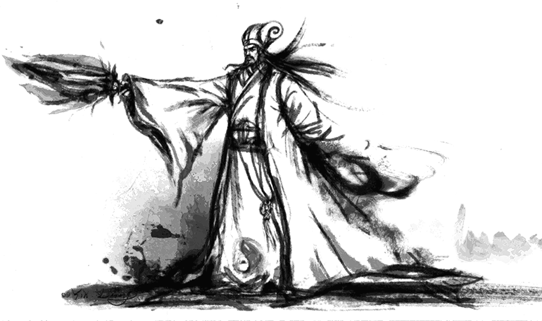

## Installation

### node.js

Install using npm:

```bash
$ npm install klotski
```

### Browser

Using bower:

```bash
$ bower install klotski
```

If you are not using any module loader system then the API will then be accessible via the `window.Klotski` object.

**CDN**

The latest version is now also always available at https://unpkg.org/pkg/klotski/

```html
<script src="https://unpkg.co/klotski/dist/klotski.min.js"></script>
```

## Usage

**Default usage**

```javascript
var Klotski = require('klotski');

var klotski = new Klotski();
var game = {
  blocks: [
    { "shape": [2, 2], "position": [0, 1] },
    { "shape": [2, 1], "position": [0, 0] },
    { "shape": [2, 1], "position": [0, 3] },
    { "shape": [2, 1], "position": [2, 0] },
    { "shape": [2, 1], "position": [2, 3] },
    { "shape": [1, 2], "position": [2, 1] },
    { "shape": [1, 1], "position": [3, 1] },
    { "shape": [1, 1], "position": [3, 2] },
    { "shape": [1, 1], "position": [4, 0] },
    { "shape": [1, 1], "position": [4, 3] },
  ],
  boardSize: [5, 4],
  escapePoint: [3, 1],
};

var result = klotski.solve(game);
```
The first block is the `blocks` list is always the one that tries to escape. 

The `shape` property defines the shape of the block, for example, `[1, 2]` means a horizontal block has 1 row and 2 columns, `[3, 1]` means a vertical block that has 3 rows and 1 column.

`position: [x, y]` is the initial position of the block, it uses zero-based numering.

`boardSize: [number of rows, number of columns]` is the size of the game board.

`escapePoint: [x, y]` is the destination point for block 0 to escape, it uses zero-based numering.

Each block's movement can also be restricted, for example `{ "shape": [2, 1], "position": [0, 0], directions: [0, 2] }`, this will only allow the block to move up and down. The directions code is as follows:
```
down: 0
right: 1
up: 2
left: 3
```

## Algorithm

### Breadth-first search (BFS)

BFS is an algorithm for traversing or searching tree or graph data structures. It starts at the tree root and explores the neighbor nodes first, before moving to the next level neighbors. Basically, we start from the initial game state, try to move every block and generate the new game states, scan each new game state and see if the 2x2 block is at the desired position, if not, we will continue to try. During the try, any duplicate state should be avoided. 

<p align="center">
  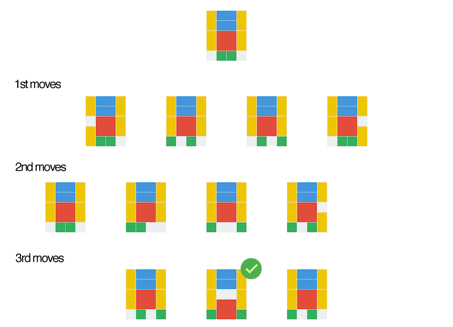
</p>
<p align="center">Breadth-first search in Klotski</p>

### Zobrist hashing

There are many different ways to represent the current state of the game. We can concatenate each block's position and type to form a string, or we can use the feature of JavaScript Number datatype to optimize the storage space, see this [article](http://simonsays-tw.com/web/Klotski/Klotski.html). The problem is it takes `O(n²)` time to compute the state, and it's really expensive, is there a better way?

We can use Zobrist hashing, according to [Wikipedia](https://en.wikipedia.org/wiki/Zobrist_hashing), _"Zobrist hashing is a hash function construction used in computer programs that play abstract board games, such as chess and Go, to implement transposition tables, a special kind of hash table that is indexed by a board position and used to avoid analyzing the same position more than once."_ Based on the current game state, if a block's position is changed, it only takes `O(1)` time to compute the next state, this is a huge win, and it is the key to boost the performance of the algorithm. See the `getZobristHashUpdate()` function in [klotski.js](src/klotski.js).

Another important factor to improve the algorithm is to avoid the mirror states. For example, the following two states are mirror states:

<p align="center">
  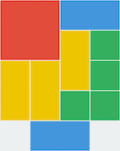
  &nbsp;&nbsp;&nbsp;&nbsp;&nbsp;
  
</p>

with Zobrist hashing, we can calculate the mirror state in `O(1)` time, see `getMirrorZobristHash()` function in [klotski.js](src/klotski.js).

At last, in order to use Zobrist hashing, we have to initialize the hashing table. Basically we need to generate a random number for each possible state inside a single cell of the board. A normal Klotski game has 20 cells (5 rows x 4 columns), and each cell can be empty or occupied by 5 different types of blocks. In [klotski.js](src/klotski.js), we use a three-dimensional array to store the initial random numbers, see `initZobristHash()` function for more details.

## Benchmark

The average running time is calculated by finding the minimum moves of each game 100 times.

| 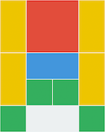 | 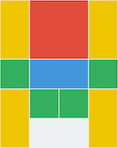 | 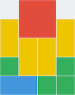 | 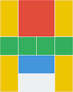 | 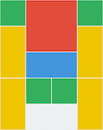 |
|:-----------------------:|:-----------------------:|:-----------------------:|:-----------------------:|:-----------------------:|
| 横刀立马 | 指挥若定 | 将拥曹营 | 齐头并进 | 并分三路 |
| 81 moves | 71 moves | 73 moves | 60 moves | 73 moves |
| 65.7 ms | 63.2 ms | 66.4 ms | 65.4 ms | 46.1 ms |

| 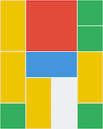 | 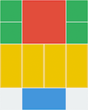 | 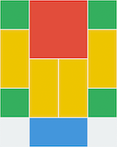 | 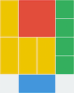 | 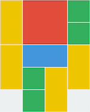 |
|:-----------------------:|:-----------------------:|:-----------------------:|:-----------------------:|:-----------------------:|
| 雨声淅沥 | 左右布兵 | 桃花园中 | 一路进军 | 一路顺风 |
| 47 moves | 54 moves | 70 moves | 58 moves | 39 moves |
| 5.3 ms | 71.9 ms | 80.6 ms | 74.8 ms | 5.0 ms |

| 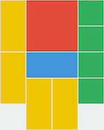 | 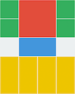 | 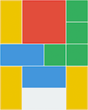 |  |  |
|:-----------------------:|:-----------------------:|:-----------------------:|:-----------------------:|:-----------------------:|
| 围而不歼 | 捷足先登 | 插翅难飞 | 守口如瓶 I | 守口如瓶 II |
| 62 moves | 32 moves | 62 moves | 83 moves | 100 moves |
| 4.6 ms | 3.1 ms | 146.8 ms | 145.8 ms | 151.0 ms |

| 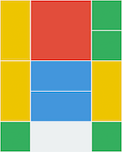 | 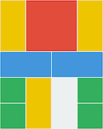 | 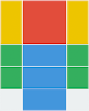 | 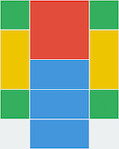 | 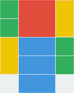 |
|:-----------------------:|:-----------------------:|:-----------------------:|:-----------------------:|:-----------------------:|
| 双将挡路 | 横马当关 | 层层设防 I | 层层设防 II | 兵挡将阻 |
| 73 moves | 84 moves | 103 moves | 121 moves | 88 moves |
| 143.6 ms | 138.9 ms | 96.6 ms | 122.2 ms | 119.7 ms |

|  | 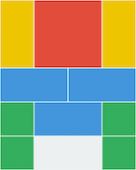 | 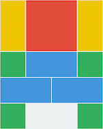 | 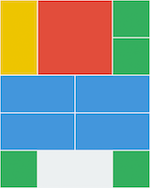 |  |
|:-----------------------:|:-----------------------:|:-----------------------:|:-----------------------:|:-----------------------:|
| 堵塞要道 | 瓮中之鳖 | 层峦叠嶂 | 水泄不通 | 四路进兵 |
| 41 moves | 107 moves | 80 moves | 78 moves | 88 moves |
| 35.2 ms | 100.1 ms | 31.2 ms | 41.5 ms | 34.8 ms |

| 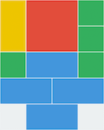 | 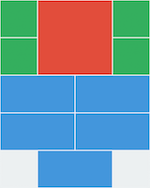 | 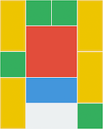 | 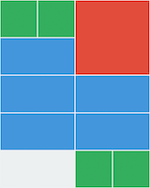 | 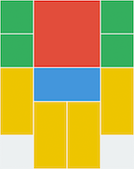 |
|:-----------------------:|:-----------------------:|:-----------------------:|:-----------------------:|:-----------------------:|
| 入地无门 | 勇闯五关 | 四面楚歌 | 前呼后拥 | 兵临曹营 |
| 88 moves | 34 moves | 57 moves | 22 moves | 34 moves |
| 34.8 ms | 3.4 ms | 30.2 ms | 1.7 ms | 3.0 ms |

| 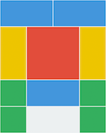 |  | 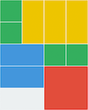 |  |  |
|:-----------------------:|:-----------------------:|:-----------------------:|:-----------------------:|:-----------------------:|
| 五将逼宫 | 前挡后阻 | 近在咫尺 | 小燕出巢 | 比翼横空 |
| 36 moves | 42 moves | 99 moves | 107 moves | 28 moves |
| 11.8 ms | 32.7 ms | 151.9 ms | 103.0 ms | 6.9 ms |

|  | 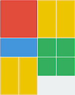 |  |  | 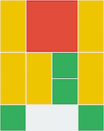 |
|:-----------------------:|:-----------------------:|:-----------------------:|:-----------------------:|:-----------------------:|
| 夹道藏兵 | 屯兵东路 | 四将连关 | 峰回路转 | 走投无路 |
| 78 moves | 73 moves | 40 moves | 140 moves | no solution |
| 34.9 ms | 67.6 ms | 6.6 ms | 141.3 ms | - |

## Contribution

Anyone who would like to contribute to the project is more than welcome.

* Fork this repo
* Make your changes
* Submit pull request

## License ##

MIT License

Copyright (c) 2017 Yong Su @jeantimex

Permission is hereby granted, free of charge, to any person obtaining a copy
of this software and associated documentation files (the "Software"), to deal
in the Software without restriction, including without limitation the rights
to use, copy, modify, merge, publish, distribute, sublicense, and/or sell
copies of the Software, and to permit persons to whom the Software is
furnished to do so, subject to the following conditions:

The above copyright notice and this permission notice shall be included in all
copies or substantial portions of the Software.

THE SOFTWARE IS PROVIDED "AS IS", WITHOUT WARRANTY OF ANY KIND, EXPRESS OR
IMPLIED, INCLUDING BUT NOT LIMITED TO THE WARRANTIES OF MERCHANTABILITY,
FITNESS FOR A PARTICULAR PURPOSE AND NONINFRINGEMENT. IN NO EVENT SHALL THE
AUTHORS OR COPYRIGHT HOLDERS BE LIABLE FOR ANY CLAIM, DAMAGES OR OTHER
LIABILITY, WHETHER IN AN ACTION OF CONTRACT, TORT OR OTHERWISE, ARISING FROM,
OUT OF OR IN CONNECTION WITH THE SOFTWARE OR THE USE OR OTHER DEALINGS IN THE
SOFTWARE.
